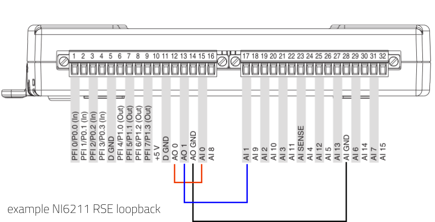
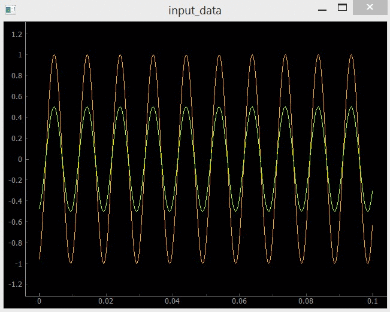
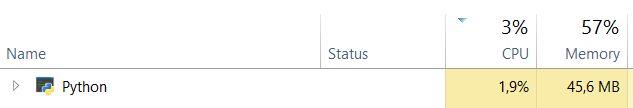

## About
This script shows a minimum working example for how to use nidaqmx package to simultaneously and continuously write to, and read from an NI DAQ 
measurement card analog I/O's.
## Who is this for?
This is for people who, in their Python apps or scripts, want to use (an NIDAQMX based) National Instruments Data Acquisition Card to continuously generate 
and acquire signals over the device analog I/Os.
## How does it work?
The script registers reading and writing "callback" functions that are hardware triggered whenever a specific amount of 
data had been generated on the output or logged into the input buffer. Pyqtgraph application is used to preview the input signals. 
## How to use
In order to verify if the script is working correctly on your hardware its best to set up a loopback connection 
between the analog outputs and inputs. NOTE: The script assumes you are using an RSE (single ended) connection. 
Below diagram shows an example loopback for NI6211.

## Assesment
The script works as intended if you can see two continuous, sinusoid signals appear on the input (the sinusoid are purposefully set each to a different amplitude).

## Aim
The aim of this script is to show a minimum working example for triggering simultaneous acquisition and generation of two signals while using minimum CPU resources.
On my system (I5-4200U) the script consumes ~2% CPU time (about half of which is just pyqtgraph drawing at 10FPS)

## Background and motivation
I set up a script similar to this prior to starting my work on [Twingo](https://github.com/mjablons1/twingo). I did this to prove to myself that its doable
and that Python implementation had enough performance to sustain a continuous, high data rate stream. 
Getting a stable data streaming operation was pretty time consuming due to large number of DAQ parameters (with some of the defaults not really working in your favour) and limited documentation online. I publish this script in hope that it saves you time.
## Something didn't work on your device?
With NI6211 I'm able to run this script all the way up to the maximum per-channel sampling rate of 125kHz. If something does not work for you please raise an issue or let me know in a discussion! Thank you.